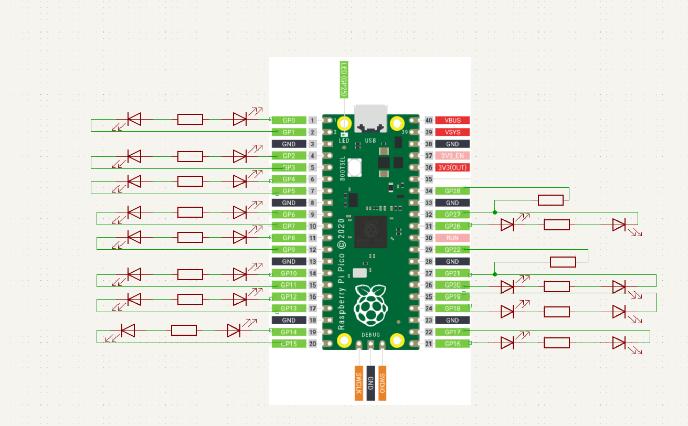

# robot-framework

# Initial config

| IO's             | Type         |
| :--------------- |:-------------:|
| GPIO 0  |         OUTPUT
| GPIO 1  |      INPUT        |
| GPIO 2  |      OUTPUT        |
| GPIO 3  |      INPUT        |
| GPIO 4  |      OUTPUT        |
| GPIO 5  |      INPUT        |
| GPIO 6  |      OUTPUT        |
| GPIO 7  |      INPUT        |
| GPIO 8  |      OUTPUT        |
| GPIO 9  |      INPUT        |
| GPIO 10  |      OUTPUT        |
| GPIO 11  |      INPUT        |
| GPIO 12  |      OUTPUT        |
| GPIO 13  |      INPUT        |
| GPIO 14  |      OUTPUT        |
| GPIO 15  |      INPUT        |
| GPIO 16  |      OUTPUT        |
| GPIO 17  |      INPUT        |
| GPIO 18  |      OUTPUT        |
| GPIO 19  |      INPUT        |
| GPIO 20  |      OUTPUT        |
| GPIO 21  |      INPUT    & OUTPUT    |
| GPIO 22  |      OUTPUT        |
| GPIO 26  |      INPUT        |
| GPIO 27  |      INPUT & OUTPUT        |
| GPIO 28 |      INPUT        |

# You can do the following schematic

